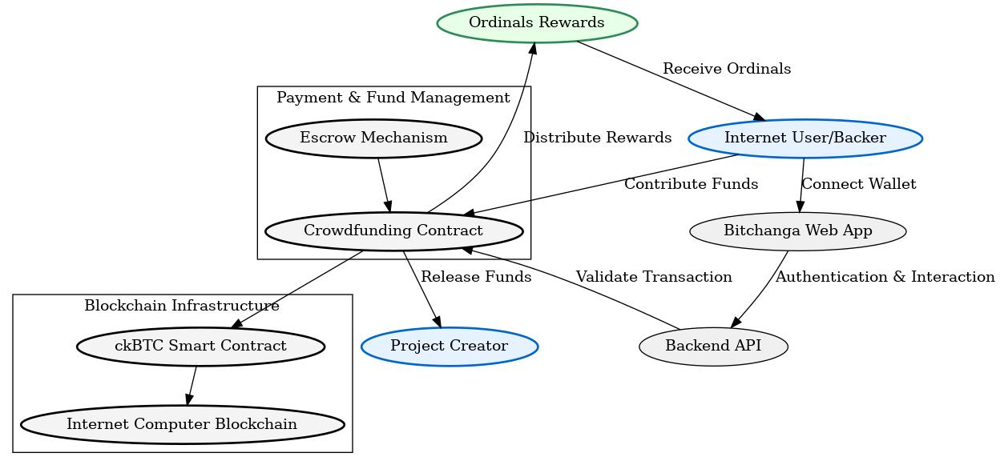

# Bitchanga - Decentralized crowdfunding platform  

Tired of traditional crowdfunding platforms with their high fees and lack of transparency? Meet Bitchanga - where builders and investors connect directly through the power of blockchain. We're leveraging ckBTC on the Internet Computer Protocol to make project funding faster, safer, and more transparent than ever before.

# What makes us different

Ever tried raising funds for your project only to get lost in a sea of paperwork and intermediaries? Or invested in a project only to wonder where your money really went? We get it. That's why we built Bitchanga with both builders and investors in mind.

---

## 🌟 Features  

### For Builders  
- **Global Exposure**: Present your project to a diverse network of investors worldwide.  
- **Milestone-based Funding**: Funds are released only when predefined milestones are achieved.  
- **Lower Fees**: Avoid the high costs of traditional financing options.  

### For Investors  
- **Safe Investments**: Contributions are secured in escrow until project milestones are met.  
- **Investment Flexibility**: Withdraw funds if you lose confidence in a project.  
- **Exclusive Rewards**: Earn NFTs based on your investment tier.  
- **Support Innovation**: Help bring groundbreaking ideas to life while making an impact.  

### Powered by Technology  
- **On-chain Transactions**: Built on the Internet Computer Protocol for speed and decentralization.  
- **Off-chain Storage**: MongoDB Atlas is used for efficient storage of non-sensitive data.  
- **Smart Contracts**: Automation ensures fair and trustless transactions.  

---

## 🚀 Getting Started  

Follow these simple steps to begin your journey on Bitchanga:  

1. **Sign Up**  
   - Register as a **Builder** or an **Investor**.  

2. **For Builders**  
   - Submit your project details, including goals and milestones.  
   - Showcase your project to attract potential investors.  

3. **For Investors**  
   - Browse projects and find those that align with your interests.  
   - Invest ckBTC and receive tier-based NFT rewards.  
   - Monitor project progress and milestones.  

4. **Escrow System**  
   - Funds are securely held in escrow until milestones are validated.  
   - Builders can only access funds after meeting milestones.  
   - Investors can withdraw contributions before milestones are met if needed.  

---

##  ⚒️ Local Setup 

Clone the repo.
- To launch the dev environment for the frontend

```sh
cd frontend
npm install
dfx start --background
dfx deploy
```

- To deploy the canister on the local network

```sh
cd crowdfunding_canister
dfx start --background 
dfx deploy
```

---

## 💡 Why ckBTC?  

- **Fast and Reliable**: Instant settlements without intermediaries.  
- **Decentralized**: Transactions are transparent and verifiable on the blockchain.  
- **Global Reach**: Easily invest or fund projects across borders.  

---

## 🔐 Security and Transparency  

Bitchanga ensures a secure and trustworthy crowdfunding environment:  
- **Smart Contract Escrow**: Funds are released only when milestones are achieved.  
- **NFT Rewards**: Recognizing investors' contributions with unique digital assets.  
- **Transparent Operations**: All transactions and progress are recorded on the blockchain.  

---

- **Frontend Canister ID**: [z4gvt-waaaa-aaaam-qcagq-cai](https://z4gvt-waaaa-aaaam-qcagq-cai.icp0.io/)
- **Backend Canister ID**: qncn4-nqaaa-aaaah-qpwsq-cai

## 🌍 Transforming Crowdfunding  

Bitchanga is redefining how projects are funded and supported globally. Join us and be part of a decentralized, transparent, and inclusive ecosystem.

👉 **[MIT License](./LICENSE)**  

---
## Technical architecture



---

**Built on:**  
- **ckBTC** on the Internet Computer Protocol  
- **MongoDB** for off-chain data storage  
- **ICP canisters** for secure, automated fund management and on chain data storage. 

**Built with ❤️ by the Bitchanga team**  

